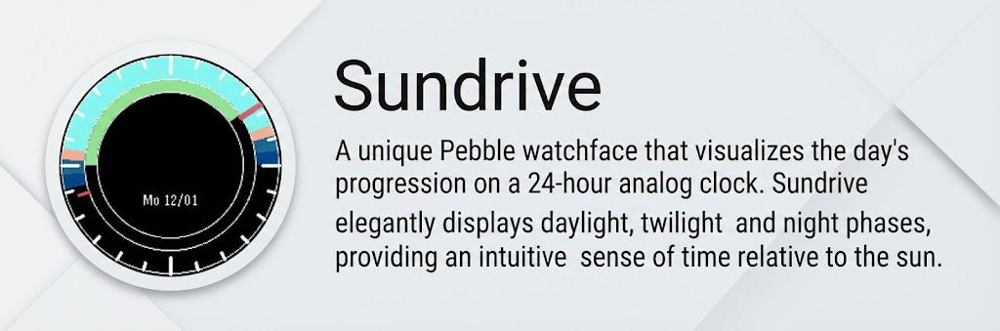
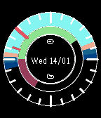
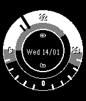
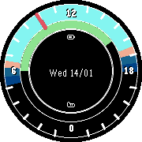

# Sundrive - 24-Hour Analog Watchface




A unique Pebble watchface that visualizes the day's progression on a 24-hour analog clock. Sundrive elegantly displays daylight, twilight, and night phases, providing an intuitive sense of time relative to the sun.

## Features

- **24-Hour Analog Display**:
  - **Noon (12:00)** at the top.
  - **Midnight (00:00)** at the bottom.
  - Hour hand rotates once per day.
- **Dynamic Twilight Visualization**:
  - Live indication of **Day**, **Civil Twilight**, **Nautical Twilight**, **Astronomical Twilight**, and **Night**.
  - Colors automatically adjust based on your location and the time of year.
- **Location Aware**: Uses GPS to calculate accurate sunrise and sunset times for your specific coordinates.
- **Universal Pebble Support**: Optimized for all Pebble models including:
  - **Round** (Time Round)
  - **Rectangular** (Classic, Steel, Time, Time Steel, 2, 2SE)
  - **Monochrome & Color** displays.
- **Battery Efficient**: Caches location and twilight data to minimize API calls and battery usage.
- **Step Tracker**:
  - Unobtrusive inner ring visualizer.
  - Configurable daily goal (default 8000 steps).
  - Shows progress relative to your goal.

## Screenshots

| Basalt (Color) | Aplite (B/W) | Chalk (Round) |
|:---:|:---:|:---:|
|  |  |  |

## How It Works

Sundrive pulls data from the [Sunrise-Sunset.org API](https://sunrise-sunset.org/api) to render colored arcs representing different light phases:

1. **Day**: Full daylight.
2. **Civil Twilight**: Sun is slightly below the horizon; artificial light may be needed.
3. **Nautical Twilight**: Horizon is indistinct; starts to get dark.
4. **Astronomical Twilight**: Darkest part of twilight; stars become visible.
5. **Night**: Complete darkness.

## Installation

### From the Rebble App Store
> TODO: Add link to app store when available

### Sideloading
1. Download the latest `.pbw` release from the [Releases](https://github.com/KilFer/sundrive/releases) page.
2. Open the file on your phone with the Pebble/Rebble app.

## Building from Source

Ensure you have the [Pebble SDK](https://rebble.io/sdk/) installed.

1. **Clone the repository:**
   ```bash
   git clone https://github.com/KilFer/Sundrive.git
   cd sundrive
   ```

2. **Build the project:**
   ```bash
   pebble build
   ```

3. **Install to emulator/phone:**
   ```bash
   # Emulator
   pebble install --emulator <aplite/basalt/chalk/diorite/emery/flint>

   # Real Device (requires IP)
   pebble install --phone 192.168.1.123
   ```

## Configuration

Sundrive is designed to automatically attempts to get your location on startup to calculate correct twilight times. The only configuration is the date format, which can be set to US (MM/DD) or European (DD/MM) format, and to show the week-of-date.

- **Manual Override (Dev Mode)**: For testing, you can enable `testMode` in `src/pkjs/index.js` to use fixed coordinates.

## Project Structure

```
sundrive/
├── resources/           # Fonts and images
├── screenshots/         # Documentation images
├── src/
│   ├── c/               # Core C watchface logic
│   └── pkjs/            # JavaScript for geolocation & API fetching
├── package.json         # Dependencies and build config
└── wscript              # Build script
```

## Credits

- **API**: [Sunrise-Sunset.org](https://sunrise-sunset.org/) for solar data.
- **SDK**: [Rebble](https://rebble.io/) for keeping the Pebble dream alive.

## License

Copyright 2026 - FBelaza
